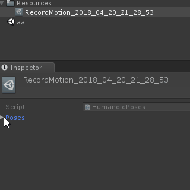

# EasyMotionRecorder
Unityエディタ上でVRIKなどのモーションキャプチャをしたHumanoidキャラクターのモーションを記録、再生するスクリプトです。
例えばVTuberの人が1テイク目でキャラの動きだけを撮って、2テイク目以降で1テイク目のモーションを再生しながら音声と表情を付ける、という使い方を想定しています。

# 使い方
EasyMotionRecorder.unitypackageだけをプロジェクトにインポートしてください。  
ダウンロードリンクはこちら  
https://github.com/duo-inc/EasyMotionRecorder/blob/master/EasyMotionRecorder/EasyMotionRecorder.unitypackage

## Setup手順
0. モーションキャプチャ対象のキャラクターをHumanoidにしておく。OculusTouchやViveコントローラ、（あるいはAxisNeuronやKinect）の動きがエディタ上で反映されているシーンをセットアップする。
1. シーン上に /Assets/EasyMotionRecorder/Prefabs/EasyMotionRecorder.prefab を配置する。
2. 1.でシーン上に配置したEasyMotionRecorderにアタッチされているMotionDataPlayerコンポーネントおよびMotionDataRecoderコンポーネントのAnimatorにモーションキャプチャ対象のキャラクターを指定する。

## モーション記録
1. Unityエディタ上で実行して、（初期設定では）Rキーを押したタイミングからモーションキャプチャデータを記録し、Xキーで記録が終了します。（ファイル書き出しを行います）
2. /Assets/Resources/の中にRecordMotion_2018~~~ みたいなファイルが生成されていたらモーション記録が成功しています。

## モーション再生
1. エディタ実行前にモーション録画で生成したファイル（RecordMotion_2018~~~ ）をシーン上のEasyMotionCapture内、MotionDataPlayerのRecordedMotionDataにセットします。
2. エディタ実行してから、（初期設定では）Sキーでモーションデータの再生開始が行えます。モーションデータの最後に到達するか、Tキーでモーションデータ再生が終了します。

# おすすめの使い方(animファイル書き出し)
モーション記録して生成されたRecordMotion_2018~~~ みたいなファイルを選択してインスペクタ上で右クリックして、「Export as humanoid animation clip」を選ぶとAnimationClipに変換されます。
変換後のAnimationClipはHumanoid準拠のモーションとしてMecanimAnimatorやUnityTimeline上で扱うことが出来ます。

もし床にキャラクターが沈んでしまう場合はHumanoidのAnimationClipにあるRoot Transform Position(Y)をBased Upon：Originalに変更して下さい。  

# FAQ
- 使っているとUnityが重い→ごめんなさい。録画中の処理負荷は多少増えます。
- 使うショートカットキーを変えたい→インスペクタ上のEasyMotionRecorder内、MotionDataRecoderとMotionDataPlayerでキーを選べるようになっています。
- 長時間記録しているとUnityが落ちた→素朴な実装を行っているため、記録中は常にメモリを食い続けます。もし長時間の記録が必要であれば、メモリの増設をお勧めします。10分そこらなら大丈夫です。
- モーションを再生しているときにスカートや髪がヒラヒラしない→ スクリプトの実行順を変更して下さい。SpringBoneやDynamicBone（MMD4mecanimを使っている場合はBulletPhisicsImpl)など、揺れモノを処理しているスクリプトのScript Execution Orderを20000以上に設定して下さい。(https://docs.unity3d.com/jp/530/Manual/class-ScriptExecution.html)
- 再生開始フレームを指定したい→MotionDataPlayer内のstartFrameで再生開始フレーム指定が可能です。

# Known Issue
- VRIK使用時、キャラクターの立ち位置がズレることがある →VRIKの処理順による問題です。再生開始時の位置を変更することで暫定対処可能です。
- その他要望はgithub issueに登録お願いします。

# 動作環境
Unity 5.6.5p2 64bit (Windows)のエディタ上で動作確認をしています。

This software is released under the MIT License, see LICENSE.txt.

（このソフトウェアは、MITライセンスのもとで公開されています。）

